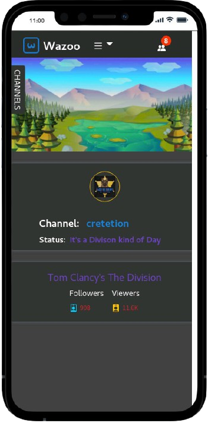
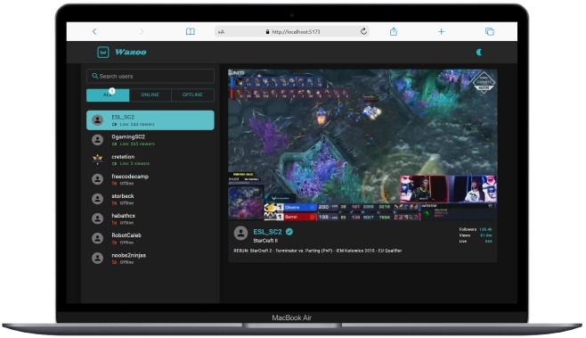

<h1 align="center">
  <br>
  <a href="https://nhope123.github.io/wazoo/"></a>
  <br>
  Wazoo
  <br>
</h1>

<h4 align="center">Twitch User data dashboard.</h4>

<p align="center">
  <a href="#key-features">Key Features</a> •
  <a href="#how-to-use">How To Use</a> •
  <a href="#validation">Validation</a> •
  <a href="#credits">Credits</a> •
  <a href="#authors">Authors</a> •
  <a href="#license">License</a>
</p>

<div align='center' >
     
  
</div>

<h2 id='key-features' >Key Featuures</h2>

- Fetch a list of Twitch User's data
- Select a group of User:
  - Select all users
  - Select online users
  - Select offline users
- Upon selecting an individual User, display User data
- Link User name to User's online channel

<h2 id='how-to-use' >How To Use</h2>

1. Run [online live](https://nhope123.github.io/wazoo/) version.
2. Clone and run this application. You'll need [Git](https://git-scm.com) and [Node.js](https://nodejs.org/en/download/) (which comes with [npm](http://npmjs.com)) installed on your computer. From your command line:

```bash
# Clone this repository
$ git clone https://github.com/nhope123/wazoo.git

# Go into the repository
$ cd wazoo

# Install dependencies
$ npm install

# Run the app
$ npm start
```

3. View React component documentation

```bash
# Run the documentation
$ npm run styleguidist server
```

Note: If you're using Linux Bash for Windows, [see this guide](https://www.howtogeek.com/261575/how-to-run-graphical-linux-desktop-applications-from-windows-10s-bash-shell/) or use `node` from the command prompt.

<h2 id='validation' >Validation</h2>

- [mobile friendly test](https://search.google.com/test/mobile-friendly?id=3PLD5N1q2U1bfb6-WEx9vw)
- [HTML Validation](https://validator.w3.org/nu/?doc=https%3A%2F%2Fnhope123.github.io%2Fwazoo%2F)

<h2 id='credits' >Credits</h2>

This software uses the following open source packages:

- [React](https://reactjs.org/) - A JavaScript library for building user interfaces.
- [Node.js](https://nodejs.org/) - An asynchronous event-driven JavaScript runtime.
- [Dart Sass](https://sass-lang.com/dart-sass) - Css preprocessor.
- [React Bootsrap icons](https://www.npmjs.com/package/react-bootstrap-icons) - Free svg icons personal use.
- [Bootstrap](https://getbootstrap.com/) - Css framework.
- [icon-icons](https://icon-icons.com/) - Free icons for personal and commercial use.
- [Uuid](https://www.npmjs.com/package/uuid) - RFC4122 UUIDs creation.
- [axios](https://www.npmjs.com/package/axios) - Promise based HTTP client for the browser and node.js

<h2 id='authors' >Authors</h2>

- [nhope](https://github.com/nhope123) - Repository
  - [Portfolio](https://nhope123.github.io/)
  - [Linkedin](https://www.linkedin.com/in/nialhope/)

<h2 id='license' >License</h2>

Creole Food is an open source software licensed as [GNU General Public License v3.0](LICENSE).
