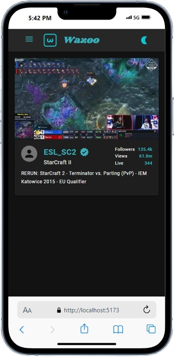

# Wazoo
Live Demo: https://nhope123.github.io/wazoo/

Wazoo is a sleek and modern web application that provides comprehensive information about Twitch users. Leveraging cutting-edge web technologies, it offers a seamless and intuitive user experience, combining simplicity with exceptional performance.

## 🚀 Features
- Intuitive User Interface
- Sleek, modern design for a seamless experience.
- Responsive layout optimized for all screen sizes, from desktop to mobile.

## ⚡ Key Functionalities
- **Browse Twitch Users:** View a curated collection of Twitch users in an organized interface.
- **Filter by Status:** Easily filter users by their status: online, offline, or view all.
- **Detailed User Profiles:** Display comprehensive details about a selected user, including status and additional info.
- **Quick Access to Streams:** Click a user's name to instantly open their Twitch channel and watch their live stream.
- **Search by Username:** Find specific Twitch users quickly with a responsive search feature.

## 🛠️ Customization
Personalize settings to suit your workflow.
- **Theme Persistence:** Enjoy a personalized experience with a theme setting that remembers your preference (dark or light mode). 

## 🔍 Data Handling
- Built-in [e.g., search or filtering features] to quickly find what you need.
[If applicable, add something about how data is handled or stored.]

## 🖥️ Tech Stack
- **Frontend:** React, Vite, TypeScript
- **Styling:** Material-ui
- **Deployment:** GitHub Pages
- **Test:** Vitest, Testing-Library/react

## 📸 Screenshots
<div align='center' >
     
  
</div>

## 🛠️ Setup & Installation
### Prerequisites
Ensure you have the following installed on your machine:

- Node.js
- Yarn or npm

### Steps
1. Clone the repository:
```bash
git clone https://github.com/nhope123/wazoo.git  
cd wazoo
```  
2. Install dependencies:
```bash
yarn install
```
3. Create and add the app name to .env file
```
touch .env && echo 'VITE_APP_NAME=<nameYouWant>' >> .env
```
4. Start the development server:
```
yarn dev
```
5. Open your browser and navigate to http://localhost:5173

## Author
- [Repository](https://github.com/nhope123)
- [Portfolio](https://nhope123.github.io/)
- [Linkedin](https://www.linkedin.com/in/nialhope/)


## 📄 License
This project is licensed under the [MIT License]('https://mit-license.org/').

